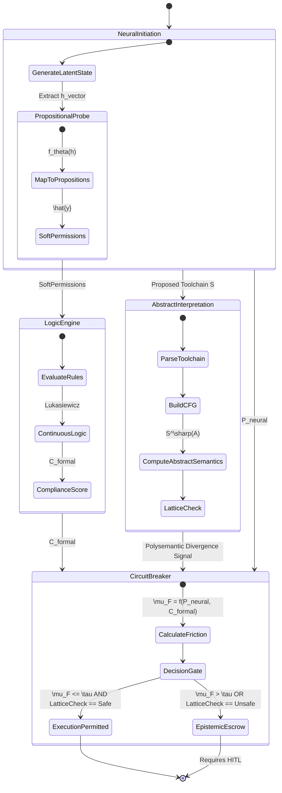

# Engineering a Hybrid Neuro-Symbolic Gatekeeper using Differentiable Logic Programming and Abstract Interpretation for Zero-Trust Tool Execution

## 1. The Propositional Probe Module

The Propositional Probe Module acts as an extraction layer, mapping continuous, high-dimensional neural representations (latent activations) into discrete, logical propositions that represent the agent's internal "safety beliefs."

### Extraction Mechanism
Let $\mathbf{h} \in \mathbb{R}^d$ be the final hidden state vector of the LLM before generating a tool-call token. We define a set of $M$ propositions $P = \{p_1, p_2, \dots, p_M\}$, where each $p_i$ is a boolean statement (e.g., $p_1 = \text{"Target file is within sandbox"}$, $p_2 = \text{"Action is read-only"}$).

We train a linear probing layer (or a small MLP) $f_\theta: \mathbb{R}^d \rightarrow [0, 1]^M$ to map $\mathbf{h}$ to the probability of each proposition being true:
$$ \hat{\mathbf{y}} = f_\theta(\mathbf{h}) $$
where $\hat{y}_i = P(p_i = \text{True} \mid \mathbf{h})$. These $\hat{y}_i$ values are the projected "Soft Permissions."

## 2. Differentiable Logic Programming

To evaluate these soft permissions against the hard rules defined in `GEMINI.md` (The Supreme Law), we use a differentiable logic engine.

### Continuous Evaluation
Let $\mathcal{L}$ be the logic program representing the constraints (e.g., `execute_tool(X) :- is_sandboxed(X), is_safe_action(X)`). Using continuous logic (e.g., Łukasiewicz logic), we evaluate the conjunctions and disjunctions differentiably:

*   **Conjunction (AND):** $\mu(A \land B) = \max(0, \mu(A) + \mu(B) - 1)$
*   **Disjunction (OR):** $\mu(A \lor B) = \min(1, \mu(A) + \mu(B))$
*   **Negation (NOT):** $\mu(\neg A) = 1 - \mu(A)$

By applying these operations to the extracted probabilities $\hat{\mathbf{y}}$, the engine calculates a **Formal Compliance Score ($C_{formal} \in [0, 1]$)**.

## 3. Abstract Interpretation of Toolchains

Before execution, the proposed tool chain is compiled into a control flow graph (CFG). We apply abstract interpretation to analyze the data flow and identify potential "Polysemantic Divergence."

### Abstraction and Concretization
Let $C$ be the concrete domain (exact state of the file system/API) and $A$ be the abstract domain (an interval lattice defining permitted operational bounds).
We define Galois connections $(\alpha, \gamma)$ where:
*   $\alpha: \wp(C) \rightarrow A$ (Abstraction function)
*   $\gamma: A \rightarrow \wp(C)$ (Concretization function)

For a tool sequence $S = \langle t_1, t_2, \dots, t_n \rangle$, we compute the abstract semantics $S^\sharp(A_{init})$. If $S^\sharp(A_{init}) \not\subseteq A_{safe}$ (where $A_{safe}$ defines the permitted lattice region), a Polysemantic Divergence is detected.

## 4. The Epistemic Circuit Breaker

The Epistemic Circuit Breaker compares the neural network's confidence with the logic engine's formal evaluation to calculate the **Friction Coefficient**.

### Friction Coefficient ($\mu_F$)
Let $P_{neural}$ be the LLM's raw probability assigned to generating the tool-call token.
Let $C_{formal}$ be the compliance score from the Differentiable Logic Engine.

The Friction Coefficient is defined as:
$$ \mu_F(t) = K_p \cdot | P_{neural}(t) - C_{formal}(t) | + K_d \cdot \frac{d}{dt} | P_{neural}(t) - C_{formal}(t) | $$

Where $K_p$ and $K_d$ are tuning parameters.

### Closed-Loop Control
If $\mu_F(t) > \tau_{friction}$ (the threshold of acceptable dissonance), the circuit breaker trips:
1.  Execution is halted immediately.
2.  The state is locked (Epistemic Escrow).
3.  A Justified Uncertainty Report (JUR) is generated requiring manual HITL (Human-in-the-Loop) verification.

## 5. State Transition Diagram

